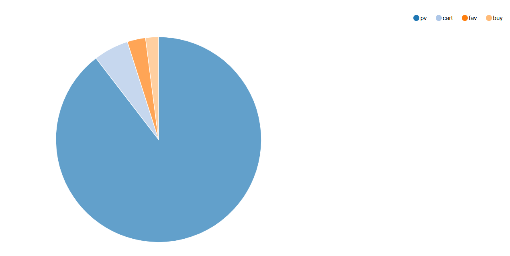
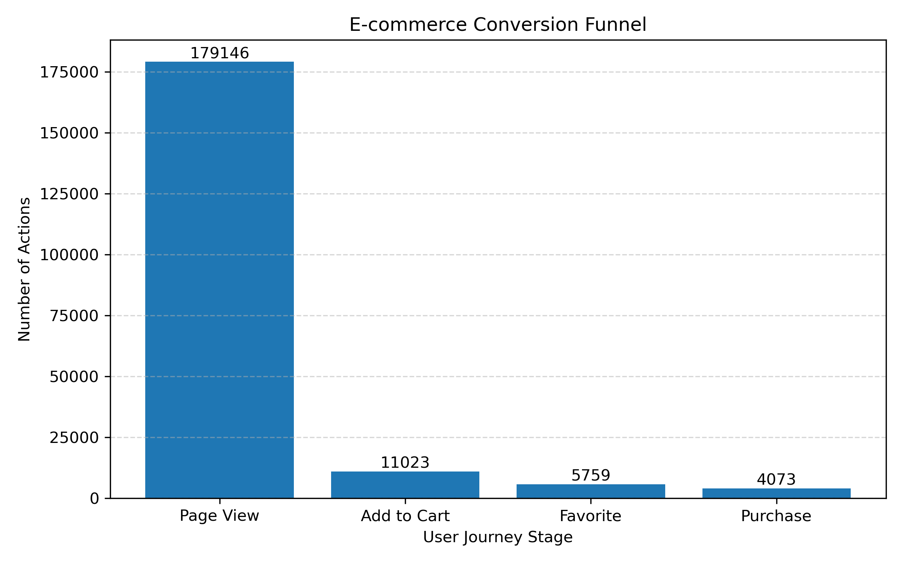
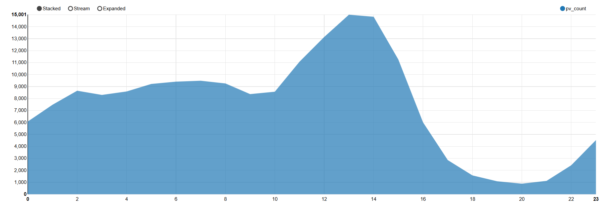
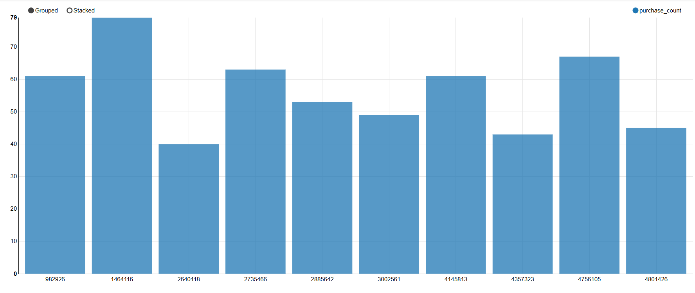
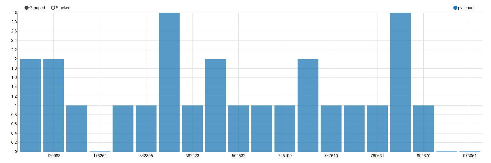

# E-commerce Customer Behavior Analysis and Purchase Prediction Using Apache Pig, Spark MLlib and HBase

## Project Overview

This project analyzes customer behavior in an e-commerce platform using the Taobao User Behavior Dataset. The main purpose of the project is to understand how users interact with products, identify purchase-related behavior patterns, and build a purchase prediction model using big data management and machine learning tools.

Instead of using only a simple Python-based analysis, this project applies a complete big data workflow:

```text
HDFS → Apache Pig → Apache Spark MLlib → HBase → Zeppelin Notebook
```

Apache Pig is used for data cleaning and behavior summarization. Apache Spark is used for feature engineering and machine learning. HBase is used to store the processed user-level behavior features. Zeppelin Notebook is used to generate the main visualizations for behavior analysis and report presentation.

This project was developed for the STQD6324 Data Management final report.

---

## Problem Statement

E-commerce platforms collect large volumes of user behavior data, including product views, cart actions, favorites, and purchases. However, raw behavior records are not immediately useful unless they are cleaned, transformed, analyzed, and interpreted properly.

A common business problem in e-commerce is that many users browse products, but only a small proportion complete purchases. Therefore, this project aims to answer the following questions:

* What are the main behavior patterns among e-commerce users?
* How large is the gap between page views and purchases?
* Which product categories show stronger purchase activity?
* Can user behavior features be used to predict whether a user is likely to purchase?
* How can big data tools be used to build a reproducible customer behavior analysis workflow?

---

## Dataset

The dataset used in this project is the **Taobao User Behavior Dataset**, which contains user interaction records from an e-commerce platform.

For this project, a 200,000-record subset was used to ensure that the workflow could run smoothly in the Hadoop sandbox environment.

### Dataset Location in HDFS

```bash
/user/maria_dev/final_report/UserBehavior_200k.csv
```

### Dataset Fields

| Column        | Description                      |
| ------------- | -------------------------------- |
| user_id       | Unique identifier of the user    |
| item_id       | Unique identifier of the product |
| category_id   | Product category identifier      |
| behavior_type | Type of user behavior            |
| timestamp     | Time when the behavior occurred  |

### Behavior Types

| Behavior Type | Meaning          |
| ------------- | ---------------- |
| pv            | Page view        |
| fav           | Add to favorites |
| cart          | Add to cart      |
| buy           | Purchase         |

---

## Tools and Technologies

| Tool              | Purpose                                                          |
| ----------------- | ---------------------------------------------------------------- |
| HDFS              | Stores raw and processed datasets                                |
| Apache Pig        | Cleans raw behavior data and generates behavior summary          |
| Apache Spark      | Creates user-level behavior features                             |
| Spark MLlib       | Trains purchase prediction models                                |
| HBase             | Stores user-level behavior features in NoSQL format              |
| Zeppelin Notebook | Generates the main visualization outputs for behavior analysis   |
| GitHub            | Stores scripts, documentation, images, and reproducibility steps |

---

## Big Data Workflow

The project follows the workflow below:

```text
Raw Taobao User Behavior Dataset
        ↓
HDFS
        ↓
Apache Pig
- Load raw CSV
- Filter valid behavior types
- Remove invalid records
- Store cleaned behavior data
- Generate behavior summary
        ↓
Apache Spark
- Read cleaned behavior data
- Create user-level behavior features
- Generate buyer label
- Train MLlib models
        ↓
HBase
- Store user-level behavior features
        ↓
Zeppelin Notebook
- Generate behavior analysis charts
- Support visualization and report discussion
```

This workflow shows how the project moves from raw data storage to cleaning, feature engineering, machine learning, NoSQL storage, and visualization.

---

## Repository Structure

```text
ecommerce-customer-behavior-bigdata/
│
├── README.md
│
├── pig/
│   └── ecommerce_cleaning.pig
│
├── spark/
│   └── ecommerce_spark_ml.py
│
├── hbase/
│   └── hbase_commands.txt
│
├── notebook/
│   └── zeppelin_visualization_notes.md
│
├── images/
│   ├── behavior_type_distribution.png
│   ├── conversion_funnel.png
│   ├── hourly_user_activity_trend.png
│   ├── top_product_categories_purchase.png
│   └── user_level_behavior_features.png
│
├── results/
│   └── model_results_summary.md
│
└── docs/
    └── reproducibility_instructions.md
```

The repository is organized based on the main stages of the project. The `pig` folder contains the data cleaning script, the `spark` folder contains the Spark MLlib script, the `hbase` folder records HBase-related commands, and the `images` folder stores the visualizations generated from Zeppelin Notebook.

---

## 1. Data Cleaning Using Apache Pig

Apache Pig was used to clean the raw Taobao user behavior data.

The Pig script is located at:

```text
pig/ecommerce_cleaning.pig
```

### Main Cleaning Steps

The Pig script performs the following tasks:

1. Loads the raw dataset from HDFS.
2. Defines the schema for user behavior records.
3. Removes records with missing values.
4. Keeps only valid behavior types:

   * `pv`
   * `fav`
   * `cart`
   * `buy`
5. Stores cleaned behavior records in HDFS.
6. Generates a behavior summary by behavior type.

### Pig Output Paths

Cleaned behavior data:

```bash
/user/maria_dev/ecommerce/processed/cleaned_behavior
```

Behavior summary:

```bash
/user/maria_dev/ecommerce/output/behavior_summary
```

### Behavior Summary Result

| Behavior Type |   Count |
| ------------- | ------: |
| pv            | 179,146 |
| cart          |  11,023 |
| fav           |   5,759 |
| buy           |   4,073 |

The result shows that page views dominate the dataset, while purchases are much less frequent. This reflects a typical e-commerce conversion issue where many users browse products, but only a smaller group completes purchases.

---

## 2. Feature Engineering Using Apache Spark

Apache Spark was used to transform cleaned behavior records into user-level features.

The Spark script is located at:

```text
spark/ecommerce_spark_ml.py
```

### User-Level Features

Spark grouped the cleaned data by `user_id` and created the following features:

| Feature       | Description                                                                         |
| ------------- | ----------------------------------------------------------------------------------- |
| pv_count      | Number of page views by the user                                                    |
| fav_count     | Number of favorite actions by the user                                              |
| cart_count    | Number of cart actions by the user                                                  |
| buy_count     | Number of purchases by the user                                                     |
| total_actions | Total number of actions by the user                                                 |
| is_buyer      | Buyer label, where 1 means the user purchased and 0 means the user did not purchase |

The target label was created using the following logic:

```text
is_buyer = 1 if buy_count > 0
is_buyer = 0 if buy_count = 0
```

After feature engineering, Spark generated **170,236 user-level records**.

---

## 3. Machine Learning Using Spark MLlib

Spark MLlib was used to train three machine learning models for purchase prediction:

* Logistic Regression
* Decision Tree
* Random Forest

### Model Features

The final model used the following input features:

```text
pv_count, fav_count, cart_count
```

The features `buy_count` and `total_actions` were not used for training because `buy_count` directly defines the target label, and `total_actions` includes purchase actions. Removing these features helps reduce data leakage and makes the model evaluation more realistic.

### Train-Test Split

The dataset was split into:

| Dataset      | Records |
| ------------ | ------: |
| Training set | 119,295 |
| Testing set  |  50,941 |

### Model Evaluation Results

| Model               |    AUC | Accuracy | F1-score |
| ------------------- | -----: | -------: | -------: |
| Random Forest       | 0.8969 |   0.9947 |   0.9944 |
| Decision Tree       | 0.8890 |   0.9947 |   0.9944 |
| Logistic Regression | 0.8885 |   0.9947 |   0.9944 |

Random Forest achieved the highest AUC score. Although all models achieved high accuracy and F1-score, AUC is more meaningful in this project because the dataset is highly imbalanced.

---

## 4. HBase Storage

HBase was used to store the user-level behavior features generated by Spark.

### HBase Table Design

| Table         | Row Key | Column Family | Columns                                                             |
| ------------- | ------- | ------------- | ------------------------------------------------------------------- |
| user_features | user_id | behavior      | pv_count, fav_count, cart_count, buy_count, total_actions, is_buyer |

### HBase Import

The Spark output was exported as TSV files and imported into HBase using `ImportTsv`.

The final HBase table contains:

```text
170,236 rows
```

This number represents unique user-level feature records after grouping by `user_id`.

---

## 5. Visualizations

The main visualizations in this project were generated using **Zeppelin Notebook**. After the data cleaning, feature engineering, and model training steps were completed in the Hadoop environment, Zeppelin Notebook was used to present the analysis results in a clearer and more readable form.

The visualization outputs are stored in the `images/` folder.

### Visualization Outputs

| Visualization                       | File                                  | Description                                                                  |
| ----------------------------------- | ------------------------------------- | ---------------------------------------------------------------------------- |
| User Behavior Type Distribution     | `behavior_type_distribution.png`      | Shows the distribution of page view, cart, favorite, and purchase actions    |
| E-commerce Conversion Funnel        | `conversion_funnel.png`               | Shows the drop from browsing behavior to purchase behavior                   |
| Hourly User Activity Trend          | `hourly_user_activity_trend.png`      | Shows how user activity changes by hour                                      |
| Top Product Categories by Purchases | `top_product_categories_purchase.png` | Shows the product categories with the highest purchase counts                |
| User-level Behavior Features        | `user_level_behavior_features.png`    | Shows user-level behavior feature patterns generated from the processed data |

### Sample Visualizations

#### User Behavior Type Distribution



#### E-commerce Conversion Funnel



#### Hourly User Activity Trend



#### Top Product Categories by Purchases



#### User-level Behavior Features



---

## Key Insights

Several insights were obtained from the analysis:

1. **Page views dominate user behavior.**
   Most user actions are product views, while purchase actions are much less frequent. This shows that many users browse products but do not complete purchases.

2. **The conversion rate from page view to purchase is low.**
   The purchase conversion rate from page views is approximately 2.27%. This suggests that the platform needs to improve the transition from browsing to purchasing.

3. **Cart and favorite actions indicate stronger purchase intention.**
   Users who add products to cart or favorites are more engaged than users who only view products. These users are suitable targets for reminders or promotional offers.

4. **User activity is time-dependent.**
   The hourly activity trend shows that user activity changes across different hours of the day. This can support better promotion timing and recommendation scheduling.

5. **User-level behavior features support purchase prediction.**
   Spark generated user-level features such as `pv_count`, `fav_count`, and `cart_count`. These features were used to train purchase prediction models.

6. **The dataset is highly imbalanced.**
   There are 166,180 non-buyers and only 4,056 buyers. This means accuracy alone is not enough to evaluate model performance.

7. **Random Forest performs best among the tested models.**
   Random Forest achieved the highest AUC score of 0.8969, making it the strongest model in this project.

---

## Recommendations

Based on the analysis, the following recommendations are proposed:

### 1. Improve Browse-to-Purchase Conversion

Since page views are much higher than purchases, the platform should focus on converting browsing users into buyers. Better product descriptions, customer reviews, clearer product images, and personalized recommendations may help improve conversion.

### 2. Target Cart and Favorite Users

Users who add products to cart or favorites show stronger purchase intention. The platform can send reminders, limited-time discounts, or free shipping offers to encourage these users to complete purchases.

### 3. Optimize Promotion Timing

The hourly user activity trend can help identify suitable periods for customer engagement. Promotional campaigns and recommendation messages can be scheduled during more active periods to increase visibility and engagement.

### 4. Prioritize High-Purchase Product Categories

Product categories with higher purchase counts can be prioritized for inventory planning, recommendation systems, and targeted promotions.

### 5. Improve Prediction with More Features

Future prediction models can include time-based features, product popularity, category preferences, session behavior, and recency of user activity. These features may improve buyer prediction.

---

## Reproducibility Instructions

### Step 1: Confirm Dataset in HDFS

```bash
hdfs dfs -ls /user/maria_dev/final_report/UserBehavior_200k.csv
hdfs dfs -cat /user/maria_dev/final_report/UserBehavior_200k.csv | head -5
```

### Step 2: Create Project Folders

```bash
cd ~
mkdir -p ecommerce_project/pig
mkdir -p ecommerce_project/spark
mkdir -p ecommerce_project/hbase
cd ecommerce_project
```

### Step 3: Create HDFS Output Directories

```bash
hdfs dfs -mkdir -p /user/maria_dev/ecommerce/processed
hdfs dfs -mkdir -p /user/maria_dev/ecommerce/output
```

### Step 4: Run Pig Cleaning Script

```bash
cd ~/ecommerce_project/pig
pig ecommerce_cleaning.pig
```

Check Pig outputs:

```bash
hdfs dfs -ls /user/maria_dev/ecommerce/processed/cleaned_behavior
hdfs dfs -ls /user/maria_dev/ecommerce/output/behavior_summary
hdfs dfs -cat /user/maria_dev/ecommerce/output/behavior_summary/part*
```

### Step 5: Create HBase Table

```bash
hbase shell
```

Inside HBase shell:

```ruby
create 'user_features', 'behavior'
list
exit
```

If the table already exists and needs to be recreated:

```ruby
disable 'user_features'
drop 'user_features'
create 'user_features', 'behavior'
exit
```

### Step 6: Run Spark ML Script

```bash
cd ~/ecommerce_project/spark
hdfs dfs -rm -r -f /user/maria_dev/ecommerce/output/user_features_hbase_tsv
spark-submit ecommerce_spark_ml.py
```

If Spark UI port conflict occurs:

```bash
spark-submit --conf spark.ui.port=4050 ecommerce_spark_ml.py
```

### Step 7: Check Spark Output

```bash
hdfs dfs -ls /user/maria_dev/ecommerce/output/user_features_hbase_tsv
hdfs dfs -cat /user/maria_dev/ecommerce/output/user_features_hbase_tsv/part* | head -10
```

### Step 8: Import Spark Output into HBase

```bash
hbase org.apache.hadoop.hbase.mapreduce.ImportTsv \
-Dimporttsv.separator=$'\t' \
-Dimporttsv.columns=HBASE_ROW_KEY,behavior:pv_count,behavior:fav_count,behavior:cart_count,behavior:buy_count,behavior:total_actions,behavior:is_buyer \
user_features \
/user/maria_dev/ecommerce/output/user_features_hbase_tsv
```

### Step 9: Verify HBase Table

```bash
hbase shell
```

Inside HBase shell:

```ruby
scan 'user_features', {LIMIT => 10}
count 'user_features'
exit
```

Expected result:

```text
170236 row(s)
```

### Step 10: Generate Visualizations Using Zeppelin Notebook

The main visualizations were generated using Zeppelin Notebook after the cleaned and processed behavior data was available in the Hadoop environment.

The generated figures were exported and saved in the `images/` folder:

```text
behavior_type_distribution.png
conversion_funnel.png
hourly_user_activity_trend.png
top_product_categories_purchase.png
user_level_behavior_features.png
```

---

## Main Results Summary

| Component                 | Result        |
| ------------------------- | ------------- |
| Cleaned behavior records  | 200,001       |
| Unique user-level records | 170,236       |
| Page views                | 179,146       |
| Cart actions              | 11,023        |
| Favorite actions          | 5,759         |
| Purchases                 | 4,073         |
| Buyers                    | 4,056         |
| Non-buyers                | 166,180       |
| Best ML model             | Random Forest |
| Best AUC                  | 0.8969        |
| HBase stored records      | 170,236       |

---

## Limitations

This project has several limitations:

* Only a 200,000-record subset was used instead of the full dataset.
* The model uses basic behavior count features and does not capture full behavior sequences.
* The dataset does not include product price, user demographic information, product descriptions, or marketing campaign data.
* The dataset is highly imbalanced, with many more non-buyers than buyers.

---

## Future Improvements

Future work can improve this project by:

* Using the full Taobao User Behavior Dataset.
* Adding time-based features such as activity hour, recency, and session duration.
* Including product category preference and product popularity features.
* Applying class weighting or resampling methods to handle class imbalance.
* Building a more advanced recommendation or customer segmentation model.

---

## Conclusion

This project demonstrates how big data tools can be used to process, analyze, model, and store e-commerce customer behavior data. Apache Pig was used to clean the raw dataset, Spark was used for feature engineering and machine learning, HBase was used for NoSQL storage, and Zeppelin Notebook was used to generate the main visualization outputs for the report.

The results show that page views dominate user behavior, while purchases are much less frequent. The conversion funnel indicates a clear drop from browsing to purchase. Machine learning results show that Random Forest achieved the best AUC score among the tested models. The project provides useful insights for improving purchase conversion, targeting high-intention users, and supporting data-driven e-commerce decision-making.

---
